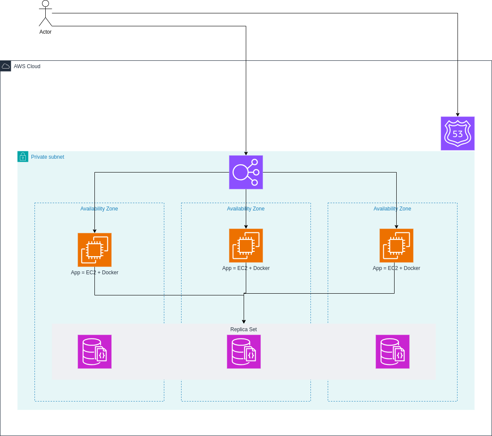

# hello-world-rest
## Abstract
Dummy service that implements a [REST API with a bunch of endpoints](hello_world_rest/README.md) that is used to
describe how to do no downtime blue/green deployments and have monitoring elements to confirm that the service was not
down during the deployment.

## Components included
- Python App
- MongoDB
- HAProxy
- Prometheus
- Prometheus Alertmanager
- Blackbox Exporter
- Grafana

## How to use the project
We include a `docker-compose` file that will allow you to do the deployments in a local machine
```shell
# Deploy the service (only the blue instance)
docker-compose up --build --force-recreate --profile initial
# Modify here the source code if you need
docker-compose up --build --force-recreate -d app-green
docker-compose down -d app-blue
# You can verify in prometheus or in the grafana dashboard we provide (if you import it) that the service was reachable
# all the time
```

## Deploy diagram
The easiest way to deploy this app is to deploy the [Docker image](Dockerfile) in EC2 instances (with docker in them) and do the balancing
using an ALB to balance between them. For the database, another EC2 instance and deploy the Docker image of mongodb


We provide a [docker-compose file](docker-compose.yaml) that simulates everything you would need to implement in a public cloud environment.

# Future work
- Add Grafana Loki for log management
- Instrument the application (APM)
